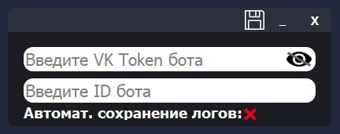

# VK Bot
VK Bot - бот для пабликов ВКонтакте с удобным интерфейсом и глубокой настройкой.

# Возможности
- Возможность глубокой настройки бота.
- Возможность добавлять свои команды для бота.

# Установка и использование
1. Устанавливаем Python 3.9.
2. Устанавливаем зависимости и настраиваем проект:
```sh
git clone https://github.com/EXG1O/VK-Bot.git
cd VK-Bot
pip3 install -r requirements.txt
```
3. Запускаем проект через команду:
```sh
cd VK_Bot
python main.py (Для Linux: python3 main.py)
```
4. Регистрируем аккаунт и заходим в него;
5. Переходим в окно настроек;
6. В поле "Введите VK Token бота" вводим ваш VK Token паблика ВКонтакте;
7. В поле "Введите ID бота" вводим ваш ID паблика ВКонтакте;
8. Производим все нужные дочерние настройки;
9. Сохраняем настройки бота;
10. Закрываем окно настроек; 
11. Запускаем бота, нажав на кнопку "Запустить бота";
12. Наслаждаемся ботом! :D

# Демонстрация ПО
## Окно авторизации:

## Окно регистрации:

## Главное окно:

## Окно настроек:

## Окно о программе:

## Окно добавление новой команды:

## Окно редактирование команды:
