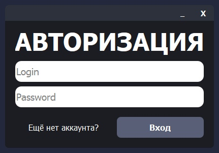
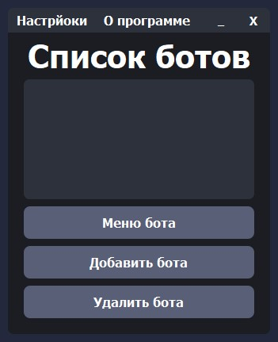
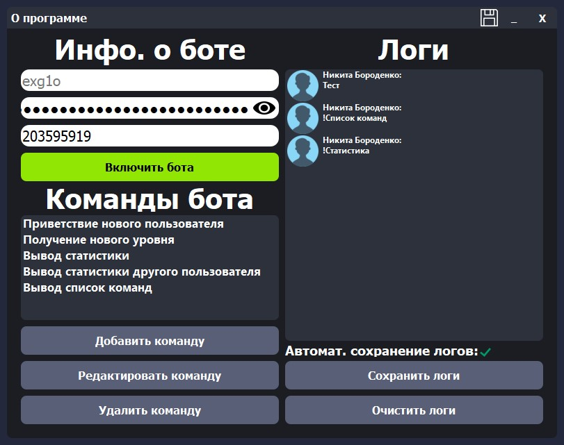
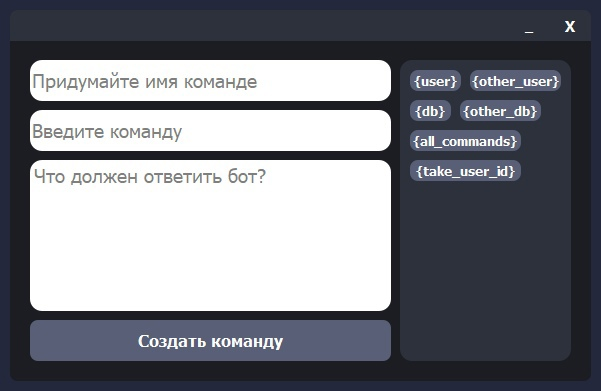
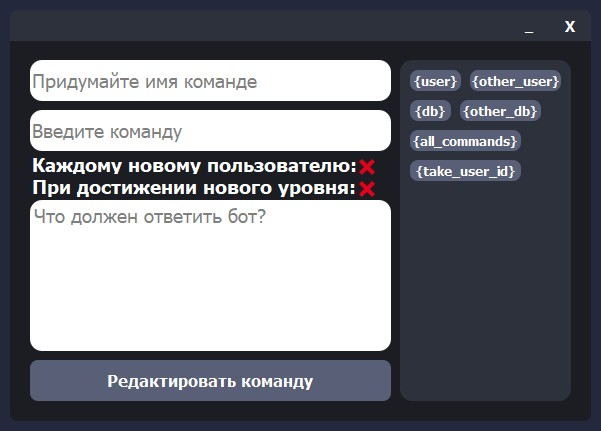

# VK Bot
VK Bot - программа для добавление неограниченное кол. ботов для пабликов ВКонтакте с удобным интерфейсом и глубокой настройкой.

# Возможности
- Возможность добавлять несколько ботов с разными настройками.
- возможность запускать несколько ботов для работы их одновременно.
- Возможность добавлять свои команды для рахных ботов.

# Установка и использование
1. Устанавливаем Python 3.9.
2. Устанавливаем и запускаем проект:
```sh
git clone https://github.com/EXG1O/VK-Bot.git
cd VK-Bot/VK_Bot
python main.py (Для Linux: python3 main.py)
```
3. Регистрируем аккаунт;
4. Авторизируемся в аккаунт;
5. Добавляем нового бота (можно добавлять неограниченно кол. ботов);
6. В поле "Придумайте имя боту" вводим имя бота;
7. В поле "Введите VK Token бота" вводим ваш VK Token паблика ВКонтакте;
8. В поле "Введите ID бота" вводим ваш ID паблика ВКонтакте;
9. После заполнения формы добавления нового бота, нажмите на кнопку "Добавить бота";
10. Выбираем добавленного бота из списка ботов, и нажимаем на кнопку "Меню бота";
11. Включаем бота, нажав на кнопку "Включить бота" (можно включить неограниченно кол. ботов);
12. Наслаждаемся ботом(и)! :D

# Демонстрация ПО
## Окно авторизации:

## Окно регистрации:

## Окно подтверждения почты:

## Главное окно:

## Окно информации о программе:

## Окно для добавления нового бота:

## Окно для управления определённым ботом:

## Окно для добавления новой команды:

## Окно для редактирования команды:
